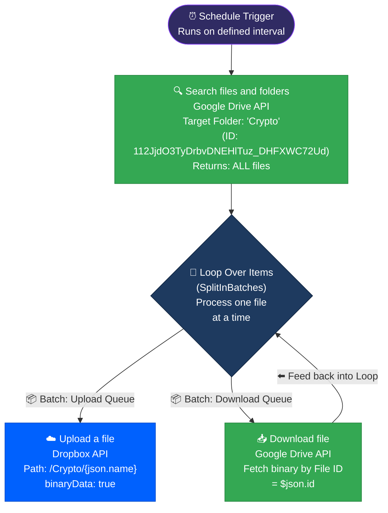

<div align="center">


<br/>


&nbsp;

&nbsp;

&nbsp;

&nbsp;


</div>

---

## 📌 What Is This?

**Crypto Vault Autosync** is a production-grade, fully automated file synchronization pipeline built in **n8n**. It runs silently on a scheduled interval, polling a designated **"Crypto"** folder in **Google Drive**, and mirroring every file it finds into a locked `/Crypto/` vault on **Dropbox**.

No manual transfers. No forgotten backups. No sync gaps.

> Critical crypto-related files, documents, and records are automatically replicated across two separate cloud providers — ensuring redundancy and peace of mind without a single human click.

---

## 🧭 System Overview

| Stage | Node | Tool | Role |
|:---|:---|:---|:---|
| **1. Trigger** | Schedule Trigger | n8n | Wakes the pipeline on a defined time interval |
| **2. Poll Source** | Search files and folders | Google Drive API | Lists **all** files in the target `Crypto` folder |
| **3. Batch Queue** | Loop Over Items | n8n | Processes files one-by-one to prevent memory overload |
| **4. Download** | Download file | Google Drive API | Pulls binary data of each file into n8n memory |
| **5. Mirror** | Upload a file | Dropbox API | Pushes binary to `/Crypto/{filename}` on Dropbox |

---

## 📸 Workflow Dashboard

<details open>
<summary><strong>👉 Google Drive → Dropbox Sync Engine</strong></summary>

<br>


<br>

</details>

---

## ⚡ Full System Architecture

<div align="center">



</div>

---

## 🔗 Node-by-Node Breakdown

### 1️⃣ Schedule Trigger

**Type:** `n8n-nodes-base.scheduleTrigger`

This is the heartbeat of the system. It wakes up the entire pipeline at a configured interval (hourly, daily, etc.). The trigger produces a timestamped payload used purely for logging/auditing purposes.

```
Pinned Test Payload:
    timestamp       : 2025-08-20T01:17:49.449+05:00
    Readable date   : August 20th 2025, 1:17:49 am
    Day of week     : Wednesday
    Timezone        : Asia/Karachi (UTC+05:00)
```

---

### 2️⃣ Search files and folders

**Type:** `n8n-nodes-base.googleDrive`

**Credentials:** Google Drive OAuth2

Hits the Google Drive API and returns ALL files and folders inside the targeted `Crypto` directory. Using `returnAll: true` ensures no pagination limits cut off results — even if dozens of files exist.

```
Configuration:
    resource      : fileFolder
    returnAll     : true
    Drive Target  : My Drive
    Folder Name   : Crypto
    Folder ID     : 112JjdO3TyDrbvDNEHlTuz_DHFXWC72Ud
```

---

### 3️⃣ Loop Over Items

**Type:** `n8n-nodes-base.splitInBatches`

The core batching controller of the entire workflow.

It receives the list of all files from the Search step, then sends them downstream **one at a time**. After each file is fully downloaded and uploaded, execution loops back here to pick up the next file. This is what prevents the workflow from crashing on large directories.

```
Loop Connections:
    Output 0 (Loop) → Upload a file    (current batch item ready to push)
    Output 1 (Done) → Download file    (queues file for binary ingestion)
    Feedback Loop   : Download file → Loop Over Items  (cycles back)
```

---

### 4️⃣ Download file

**Type:** `n8n-nodes-base.googleDrive` (Download operation)

**Credentials:** Google Drive OAuth2

Takes the `id` from the current file in the batch and requests the binary content from Google Drive. The file data is loaded in-memory within n8n's execution context, ready to be piped to Dropbox.

```
Configuration:
    operation   : download
    fileId      : ={{ $json.id }}   ← dynamic, from Loop context
    options     : {}
```

> ⚠️ **Binary in Memory:** The file is held in n8n's temporary execution buffer. For large files (>50MB), ensure your n8n instance has sufficient RAM configured.

---

### 5️⃣ Upload a file

**Type:** `n8n-nodes-base.dropbox`

**Credentials:** Dropbox OAuth2

Pushes the binary file data to Dropbox using the original filename, preserving folder structure. The destination path is dynamically built using the original filename from Google Drive.

```
Configuration:
    authentication : oAuth2
    path           : /Crypto/{{ $json.name }}    ← dynamic filename
    binaryData     : true
```

```
Example Paths:
    /Crypto/seed_phrase_backup.pdf
    /Crypto/portfolio_2025_Q3.xlsx
    /Crypto/wallet_addresses.txt
```

---

## 📊 Data Flowing Through the System

### File Record (from Google Drive Search)

| Field | Description |
|:---|:---|
| `id` | Google Drive File ID — used to download the binary |
| `name` | Original filename — used to construct the Dropbox upload path |
| `mimeType` | File type (PDF, XLSX, etc.) — passed through unchanged |
| `modifiedTime` | Last modified timestamp |
| `size` | File size in bytes |
| `parents[]` | Parent folder ID (`112JjdO3...`) confirming source |

### Upload Target (Dropbox)

| Field | Value |
|:---|:---|
| Destination Folder | `/Crypto/` |
| Filename | `{name}` from source file (dynamic) |
| Transfer Method | Binary stream via n8n execution buffer |
| Auth Method | OAuth2 (Dropbox App) |

---

## 🔄 End-to-End Sequence

```mermaid
sequenceDiagram
    participant CRON as ⏰ Scheduler
    participant GD_S as 🔍 Google Drive (Search)
    participant LOOP as 🔁 Loop
    participant GD_D as 📥 Google Drive (Download)
    participant DB as ☁️ Dropbox

    CRON->>GD_S: Trigger: fetch all files in /Crypto
    GD_S->>LOOP: Return file list [file1, file2, ... fileN]
    
    loop For each file
        LOOP->>GD_D: Pass current file ID
        GD_D->>GD_D: Fetch binary data
        GD_D->>LOOP: Return binary in memory
        LOOP->>DB: Upload binary → /Crypto/{filename}
        DB-->>LOOP: ✅ Upload confirmed
        LOOP->>LOOP: Next item in queue
    end

    Note over LOOP,DB: All files mirrored ✅
```

---

## ⚙️ Key Design Decisions

| Decision | Reason |
|:---|:---|
| `returnAll: true` on Search | Avoids silent data loss on pagination — all files are guaranteed to be fetched regardless of folder size |
| `SplitInBatches` loop | Without batching, large file lists would cause n8n to buffer everything into memory at once, risking crashes on file-heavy folders |
| Dynamic path `/Crypto/{{ $json.name }}` | Preserves original filenames in Dropbox automatically — no hardcoding needed for each file |
| `binaryData: true` on Dropbox upload | Pipes the actual binary stream correctly — treats the upload as a file, not JSON text |
| Download → Loop feedback | Correctly chains ingestion into the upload queue without requiring a secondary trigger or intermediate storage layer |
| Schedule Trigger (not Webhook) | No external event to hook into — interval polling is the right model for a passive folder that receives files manually |

---

## 📈 How It Works End-to-End

```
Scheduler fires (daily/hourly)
        ↓
Google Drive scans "Crypto" folder
Returns list of all files
        ↓
Loop picks up File #1
        ↓
Google Drive downloads binary of File #1
        ↓
Loop passes binary to Dropbox
Dropbox uploads → /Crypto/file1name.ext
        ↓
Upload confirmed ✅ → Loop moves to File #2
        ↓
... repeats for all files ...
        ↓
All files mirrored → workflow execution ends
```

No cloud storage vendor lock-in. Files always exist in two separate cloud providers.

---

## 🛠️ Tech Stack

<div align="center">

| Tool | Role |
|:---|:---|
|  | Workflow orchestration, batching engine, scheduler |
|  | Primary source cloud storage (active workspace) |
|  | Redundant cold-storage mirror vault |

</div>

---

## 🚀 Setup Guide

### Prerequisites

- [ ] n8n instance (self-hosted or n8n cloud)
- [ ] Google Cloud Developer App with Drive API scope enabled
- [ ] Dropbox Developer App with `files.content.write` scope
- [ ] A Google Drive folder named `Crypto` (or use an existing one)

### Credentials Required

| Credential | Used by |
|:---|:---|
| `Google Drive account` (OAuth2) | Search files + Download file nodes |
| `Dropbox account` (OAuth2) | Upload a file node |

### Configuration Steps

1. **Import Workflow** JSON into n8n
2. **Connect Credentials** — Link Google Drive OAuth2 and Dropbox OAuth2 in the node panel
3. **Update the Google Drive Folder:**
   - Open the `Search files and folders` node
   - Change the `folderId` to your specific Drive folder ID
   - *(Current default: `112JjdO3TyDrbvDNEHlTuz_DHFXWC72Ud`)*
4. **Set the Schedule Interval:**
   - Open the `Schedule Trigger` node
   - Choose your preferred frequency (daily recommended for cold backup use case)
5. **Activate the Workflow** — Toggle to **Active** ✅

> **Test First:** Use the `Pin Data` feature on the `Schedule Trigger` to dry-run with the existing pinned test payload before activating live.

---

<div align="center">

**Built by [Abdul Rehman](https://github.com/ar-rehman786)**

[](mailto:abdulrehmanhameed4321@gmail.com)
&nbsp;
[](https://www.sloraai.com/)
&nbsp;
[](https://github.com/ar-rehman786)

</div>


