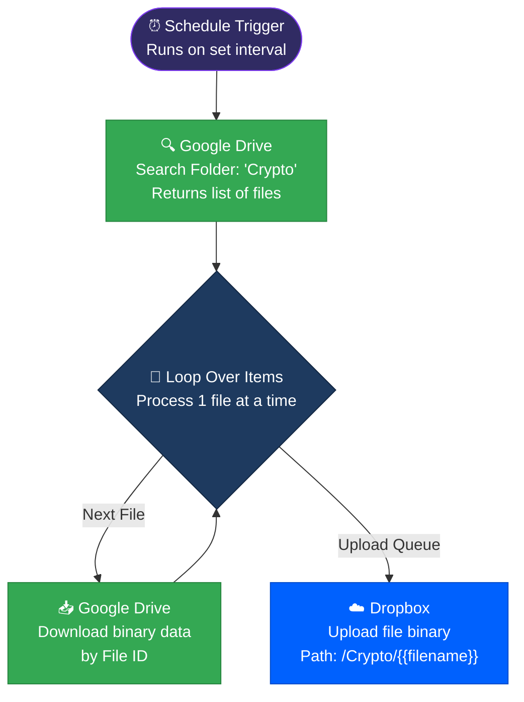

 

&nbsp;

&nbsp;

&nbsp;

&nbsp;

---

## 📌 What Is This?

**Crypto Vault Autosync** is a lightweight, high-reliability automated backup pipeline built in **n8n**. 

It runs on a scheduled interval to poll a specific *"Crypto"* folder in **Google Drive**, search for newly added or modified files, download them securely, and autonomously upload them to a mirrored `/Crypto/` vault in **Dropbox**. 

> Zero manual drag-and-drop. Redundant cold storage backups for critical crypto-related files and documents, operating fully autonomously.

---

## 🧭 System Overview

| Stage | Node / Tool | Role |
|:---|:---|:---|
| **1. Trigger** | Schedule Trigger | Wakes up the pipeline on a defined interval (e.g., daily/weekly). |
| **2. Poll Data** | Google Drive (Search) | Targets folder `112JjdO3...XWC72Ud` and lists all files inside. |
| **3. Batching** | Loop Over Items | Splits the file list into a batched queue to prevent memory limits. |
| **4. Ingestion** | Google Drive (Download) | Securely pulls the binary data of the file into n8n's temporary memory. |
| **5. Mirroring** | Dropbox (Upload) | Pushes the binary file to Dropbox at path `/Crypto/{filename}`. |

---

## 📸 Workflow Dashboard

<strong>👉 Storage Mirror Engine</strong>

 

 

---

## ⚡ Full System Architecture

---

## 🛠️ Tech Stack

| Tool | Role |
|:---|:---|
|  | Workflow orchestration and binary data streaming |
|  | Primary data source & active workspace |
|  | Redundant offline/cold storage mirror |

---

## 🚀 Setup Guide

### Prerequisites
- [ ] Active n8n environment
- [ ] Google Workspace / Developer App (OAuth2)
- [ ] Dropbox Developer App (OAuth2)

### Activation Steps
1. **Import Workflow:** Import `Google Drive: Poll & Download (Crypto).json` into n8n.
2. **Setup Credentials:** Connect your Google Drive OAuth2 and Dropbox OAuth2 credentials in the respective nodes.
3. **Verify Google Drive Folder ID:** 
   Ensure the `Search files and folders` node points to your correct Drive folder. (Currently hardcoded to `112JjdO3TyDrbvDNEHlTuz_DHFXWC72Ud`).
4. **Configure Interval:** Set the `Schedule Trigger` to your desired frequency (e.g., Every day at 2:00 AM).
5. **Activate:** Toggle the workflow to active.

> **Note on Binary Data:** This workflow streams binary data directly through n8n. Ensure your hosting environment has enough memory configured if you are syncing massive (1GB+) files.

---

**Built by [Abdul Rehman](https://github.com/ar-rehman786)**

&nbsp;

&nbsp;

